#Sketch Description

##Affichage Lancement
On demande si l'utilisateur a plus de 18ans:
	-> **Si oui** = entrée sur page de recherche d'une bière
	-> **Si non** = Fermeture du Logiciel
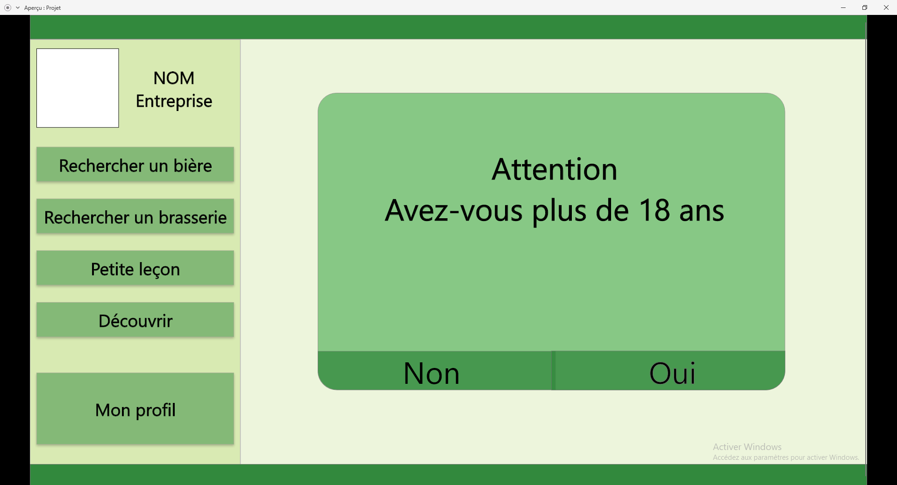

#Menu
Différents boutons pour accéder aux différentes options de l'appli
Ainsi que le logo et nom de l'appli
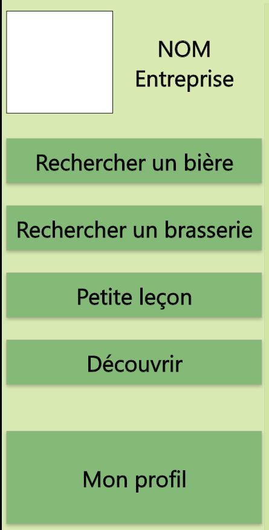

##Recherche Bière
Grande barre de rechereche pour faire une recherche par nom
Un menu déroulant pour affiner la recherche
Liste des bières correspondant aux différents paramètres
On peut accéder aux détails d'une biere avec un bouton
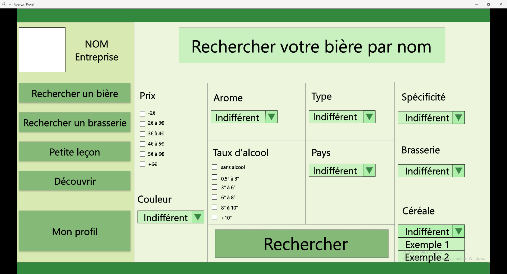
Maintenant on peut voir apparaitre de nombreux parametres permettant de détaillé notre recherche
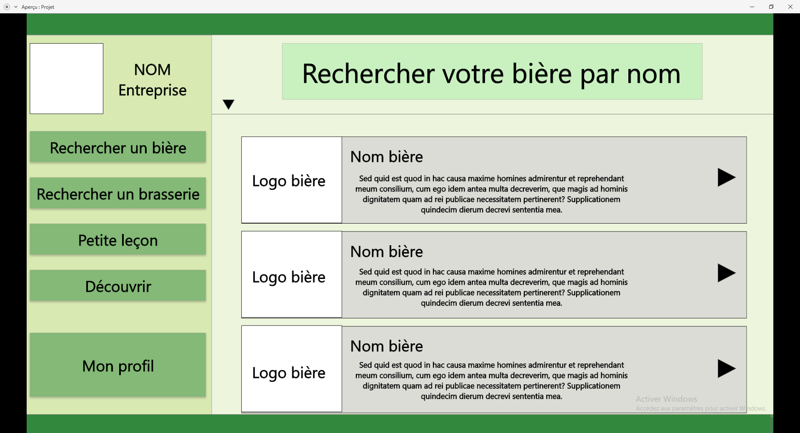

##Biere
Détail d'un produit avec toutes informations
détaillé dans le [dictionnaire](../README.md)
Croix permettant de retourner en arriere
Systeme de Favoris et de notes
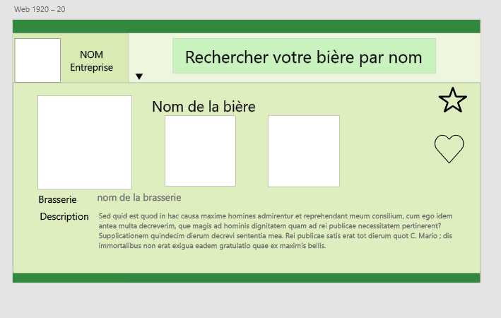

##Recherche Brasserie
Bar de recherche par nom
Pour chaque brasserie donné, accès à une page détaillé de brasserie
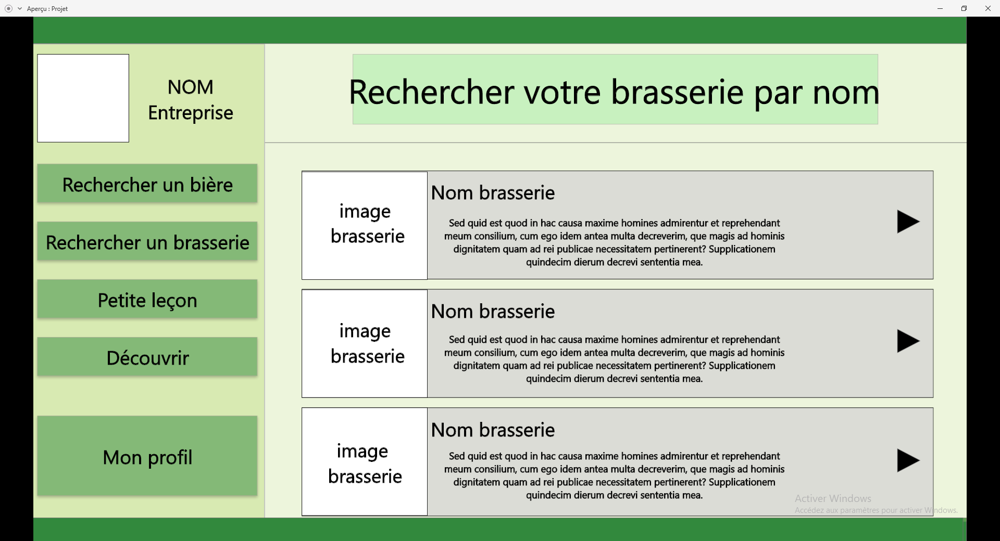

##Brasserie
Détail d'une brasserie avec toutes ces informations 
celles ci sont décris dans le dictionnaire [dictionnaire](../README.md)
Croix permettant de retourner en arrière
Systeme de Favoris et de notes
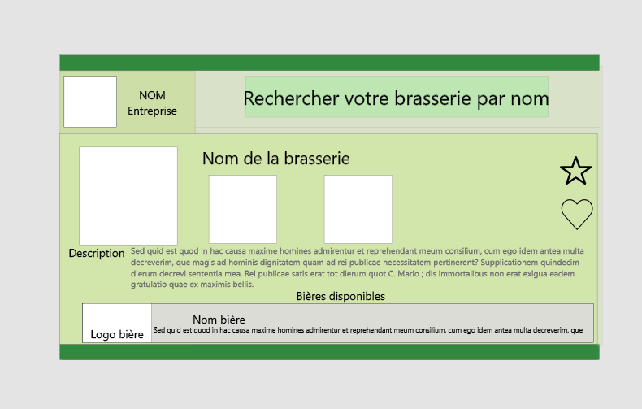

##Découverte
Différents boutons permettant d'accèder à des bières selon des critères 
Celle-ci ouvre une biere de maniere aléatoire selon les critères 
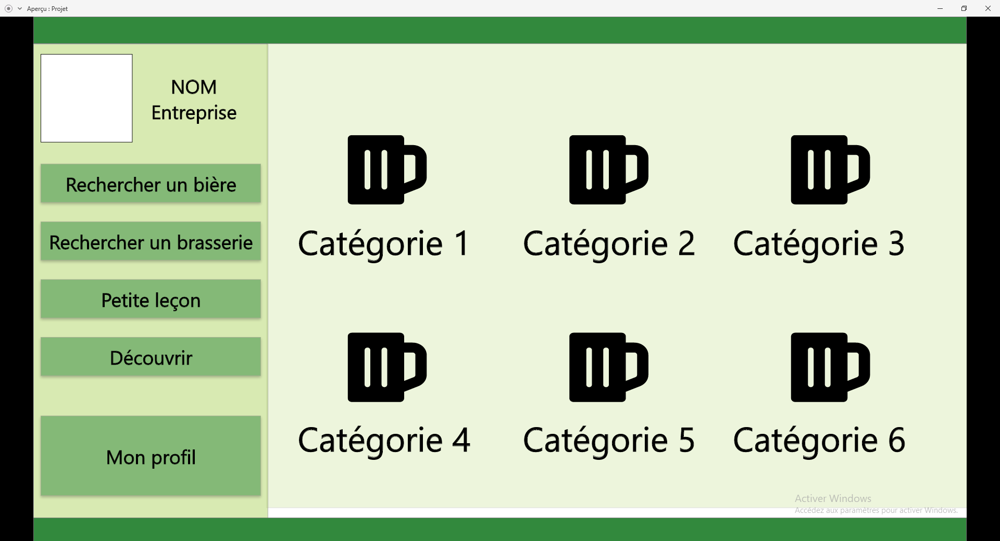

##Petites Leçons
Différents boutons permettant d'en apprendre plus selon le theme de la lecons
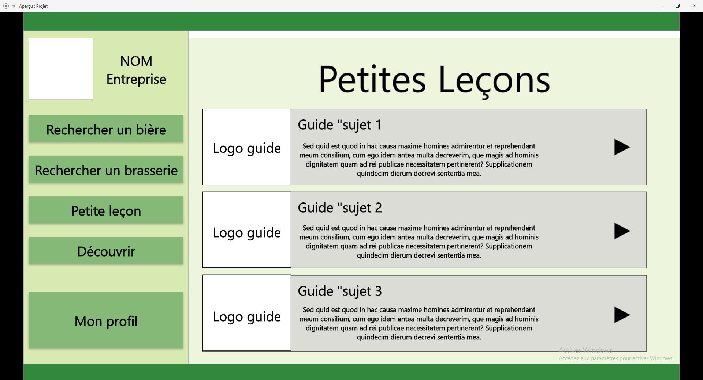

Une lecons contient des images et majoriterement du texte
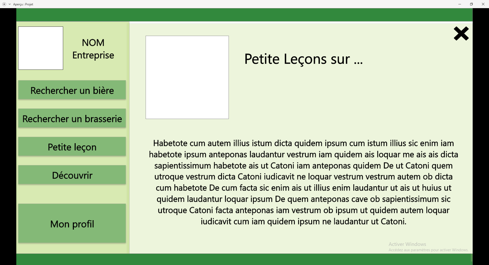

##Mon Profil
Détail de toutes mes informations + boutons permettant de modifier les infos
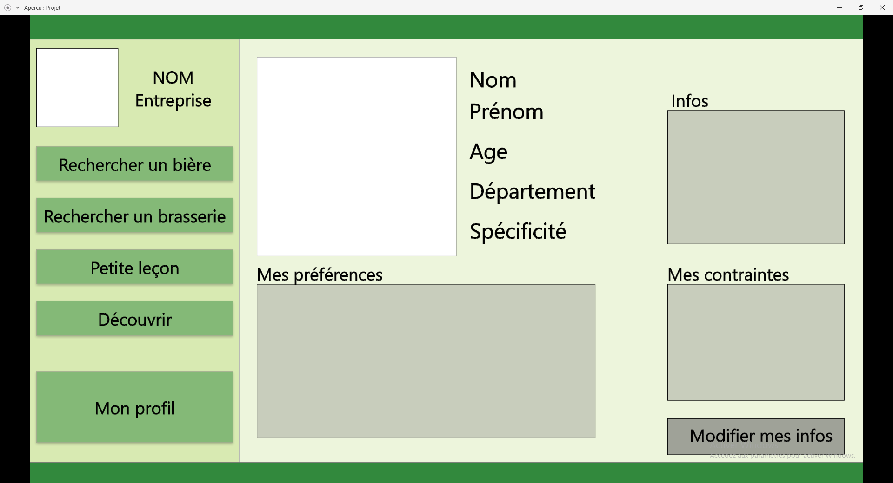